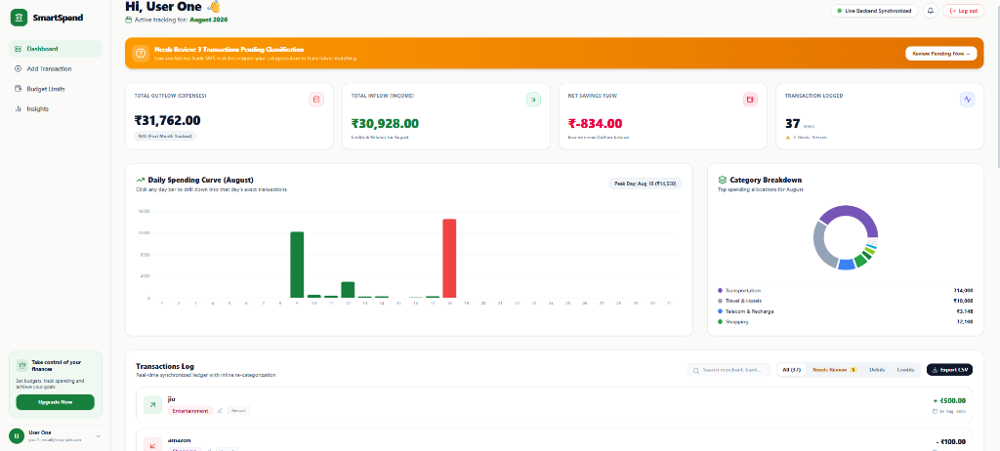
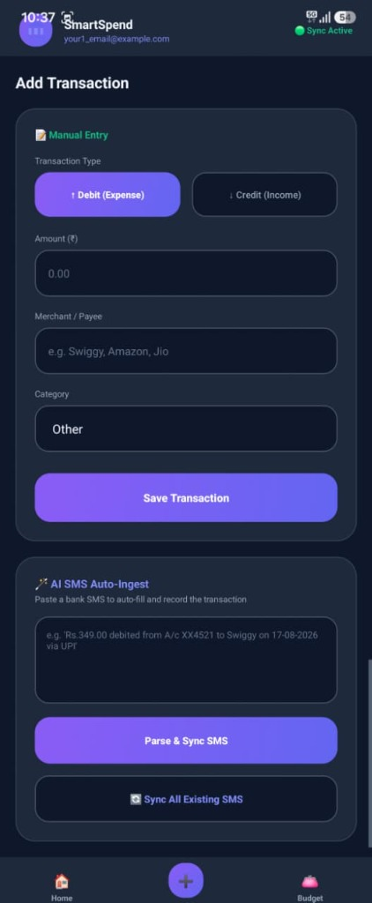
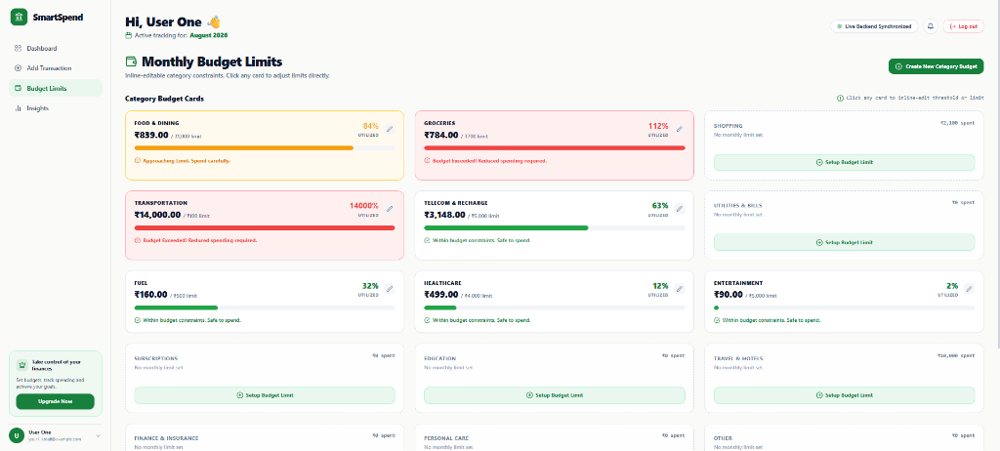
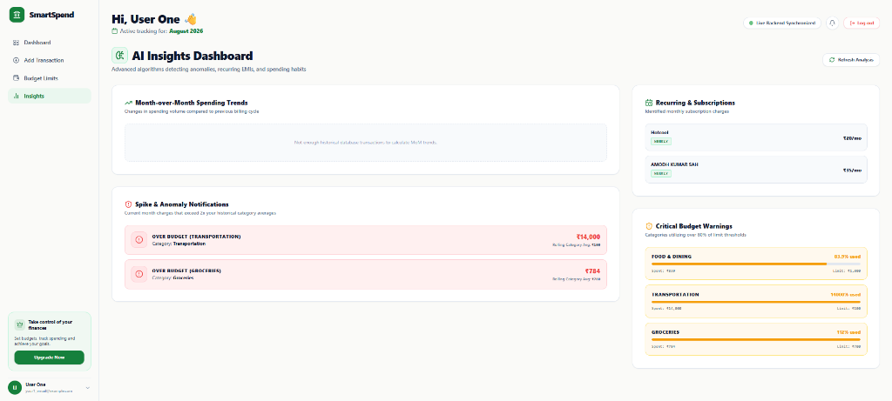

# 💳 SmartSpend — Intelligent Expense Analytics & SMS Sync

[](https://www.python.org/)
[](https://fastapi.tiangolo.com/)
[](https://render.com/)
[](https://developer.android.com/)
[](https://react.dev/)

**SmartSpend** is a full-stack financial analytics platform designed to automate personal and family expense tracking. It features **on-device automatic Indian bank SMS parsing**, **multi-tiered AI merchant categorization**, **budget alerts**, and **real-time synchronization between mobile app and web dashboard**.

---

## 🌟 Key Features

* **📱 Automatic SMS Auto-Sync**: Background Android broadcast receiver intercepts incoming bank & UPI SMS messages (HDFC, ICICI, SBI, Axis, Kotak, Paytm, GPay, etc.) and auto-logs expenses with instant status bar notifications.
* **🧠 5-Layer Categorization Pipeline**: Pre-indexed engine matching 255+ top Indian merchants, 981 ISO MCC codes, UPI VPA handles, regex heuristics, and self-learning user feedback overrides.
* **🔒 SHA-256 Deduplication**: Prevents duplicate entry of transactions across multiple ingestion paths (SMS, manual form, background sync).
* **📊 Analytics Dashboard**: Live Net Cash Flow calculation ($\text{Income} - \text{Expenses}$), category spending donut charts, daily spend bar charts, and spending spike detection.
* **⚠️ Category Budget Limits**: Set monthly category spending caps with real-time warning alerts and status badges (`Near limit`, `Over limit`).
* **🌐 Cross-Platform Sync**: Mobile App (Android Kotlin) and Web Dashboard (React + Vite) are connected to a unified PostgreSQL cloud backend.

---

## 🧪 Engineering Notes

This project intentionally documents its own architecture, trade-offs, and edge cases:

* 📄 **[Detailed Architecture & Engineering Notes](docs/architecture.md)** — Covers:
  - The 5-layer categorization pipeline & confidence scoring matrix.
  - SHA-256 deduplication strategy across ingestion channels.
  - Scaling roadmap for 1M+ users (PgBouncer connection pooling, read replicas, Redis/Celery async worker queues, B-Tree database indexes).
* 📄 **[Comprehensive Test Scenarios](docs/test_scenarios.md)** — 35+ realistic Indian bank SMS test cases (ICICI, HDFC, SBI, Axis, Kotak, PNB, budget alerts, manual entries).

---

## 📱 Screenshots

> _Add dashboard, add-transaction, budget-limits, and insights screenshots here._

| Dashboard | Add Transaction | Budget Limits | AI Insights |
|:---:|:---:|:---:|:---:|
|  |  |  |  |

---

## 🛠️ Tech Stack

* **Backend**: Python FastAPI, SQLAlchemy (Async ORM), Pydantic v2, PostgreSQL (Render Cloud).
* **Frontend**: React 19, Vite, Tailwind CSS, Axios, Recharts.
* **Mobile**: Android SDK (Kotlin), ViewBinding, Retrofit2, Coroutines, BroadcastReceiver, NotificationCompat.

---

## 🚀 Live Links & Endpoints

* **Cloud API Base URL**: `https://expense-tracker-pk4d.onrender.com`
* **Swagger API Docs**: `https://expense-tracker-pk4d.onrender.com/docs`
* **Local Web Dashboard**: `http://localhost:5173/`

---

## 📥 Quick Start & Local Setup

### 1. Backend Setup
```bash
cd backend
python -m venv venv
venv\Scripts\activate  # Windows
pip install -r requirements.txt
python -m uvicorn main:app --host 0.0.0.0 --port 8000
```

### 2. Frontend Setup
```bash
cd frontend
npm install
npm run dev
```

### 3. Android Mobile App Setup
Open `android/` directory in **Android Studio**, sync Gradle, and run `assembleDebug` to build `app-debug.apk`.