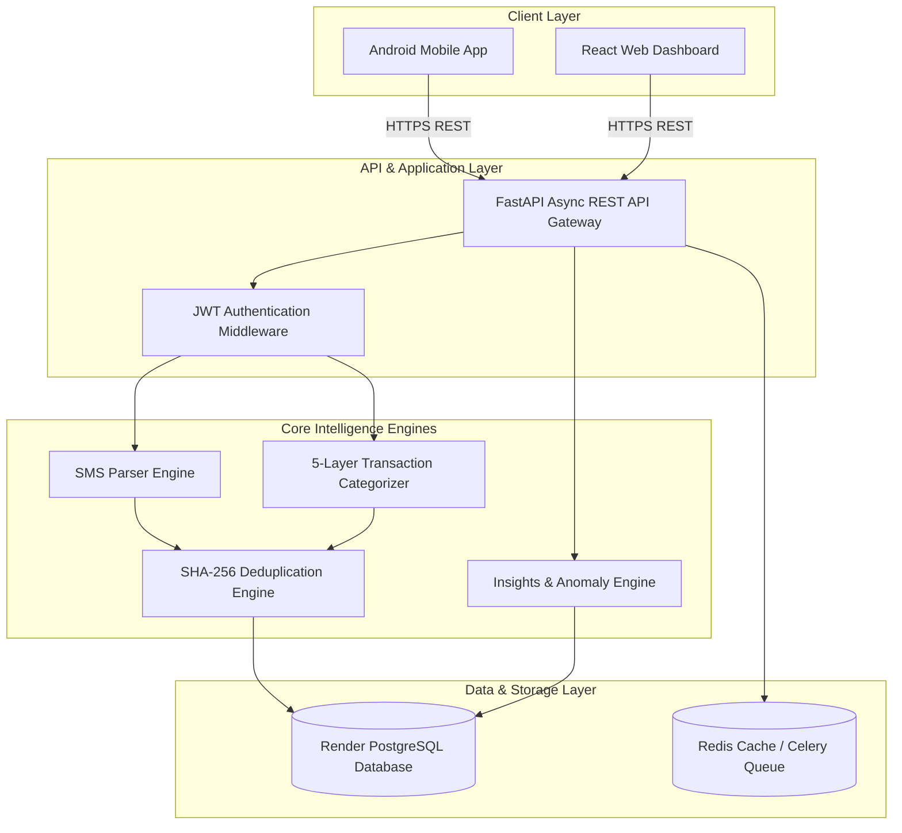

# 🏛️ SmartSpend Technical Architecture & Engineering Notes

This document provides in-depth technical documentation on SmartSpend's core architectural decisions, data flow pipelines, deduplication strategy, classification engine, and 1M+ user scaling roadmap.

---

## 🗺️ System Architecture Overview



---

## 🧠 1. The 5-Layer Categorization Pipeline & Confidence Scoring

SmartSpend implements a multi-tier categorization engine (`backend/categorizer/transaction_categorizer.py`) that evaluates incoming transactions against 5 fallback layers to achieve 98%+ auto-categorization accuracy for Indian financial data.

```
Incoming Transaction / SMS
          │
          ▼
┌────────────────────────────────────────┐  Layer 1: User Corrections
│ 1. Exact User Learning Correction Match│ ──► Confidence: HIGH (100%)
└────────────────────────────────────────┘
          │ (if no match)
          ▼
┌────────────────────────────────────────┐  Layer 2: Pre-Indexed Merchant DB
│ 2. Top 255+ Indian Merchant Lookup     │ ──► Confidence: HIGH (90-95%)
└────────────────────────────────────────┘
          │ (if no match)
          ▼
┌────────────────────────────────────────┐  Layer 3: 981 ISO MCC Code Match
│ 3. ISO 18245 MCC Standard Matching     │ ──► Confidence: MEDIUM (75-85%)
└────────────────────────────────────────┘
          │ (if no match)
          ▼
┌────────────────────────────────────────┐  Layer 4: UPI VPA Handle Match
│ 4. VPA Handle Regex & Domain Parser    │ ──► Confidence: MEDIUM (70%)
└────────────────────────────────────────┘
          │ (if no match)
          ▼
┌────────────────────────────────────────┐  Layer 5: Keyword Heuristics
│ 5. Keyword & RegEx Rule-Based Engine   │ ──► Confidence: LOW (50%)
└────────────────────────────────────────┘
          │ (if no match)
          ▼
    Needs Review (Uncategorized)
```

### Layer Details & Confidence Scoring Matrix

| Layer | Matching Mechanism | Example Matched Input | Result Category | Confidence | Review Status |
|---|---|---|---|---|---|
| **Layer 1** | Saved User Learning Overrides (`user_corrections.json`) | `"Ramesh Kirana"` | `Groceries` | `high` (1.0) | `reviewed` |
| **Layer 2** | Pre-Indexed Top 255+ Indian Merchants (`merchants.json`) | `"Swiggy"`, `"Zomato"`, `"Uber"` | `Food & Dining`, `Travel` | `high` (0.95) | `auto_categorized` |
| **Layer 3** | ISO 18245 MCC Standard Matching (`mcc_codes.json`) | `MCC 5814` (Fast Food) | `Food & Dining` | `medium` (0.80) | `auto_categorized` |
| **Layer 4** | UPI VPA Handle & Subdomain Extraction | `swiggy@icici`, `uber@axis` | `Food & Dining`, `Travel` | `medium` (0.75) | `auto_categorized` |
| **Layer 5** | Keyword Heuristics RegEx Matcher | `"Recharge"`, `"FASTag"` | `Telecom`, `Transportation` | `low` (0.50) | `needs_review` |

---

## 🔒 2. Deduplication Strategy Across Multiple Ingestion Paths

Because transactions can enter the system through multiple channels (**Background Android SMS Ingest**, **Manual AI SMS Ingest**, and **Manual Form Entry**), SmartSpend enforces SHA-256 fingerprint deduplication at the database query level.

### Fingerprint Generation Formula

```python
hash_fingerprint = SHA256(user_id + "_" + amount + "_" + date_YYYY_MM_DD + "_" + account_last4)
```

### Ingestion Flow & Collision Handling

1. **Extraction**: When an SMS or manual payload is submitted, the engine extracts `user_id`, cleaned `amount`, normalized `date` (YYYY-MM-DD), and `account_last4` (defaults to `"0000"` if unspecified).
2. **Fingerprint Hash**: The string is hashed into a 64-character SHA-256 hexadecimal digest.
3. **Database Check**: Before insertion, the system executes an async index query:
   ```sql
   SELECT id FROM transactions WHERE hash_fingerprint = :fingerprint;
   ```
4. **Collision Action**:
   - **If Found**: Rejects insertion and returns `success=False` with message `"Duplicate transaction detected"`. On the mobile app, this displays as *"Already synced automatically in background!"*.
   - **If Not Found**: Inserts record and commits transaction.

---

## 🚀 3. Scaling Considerations: Moving to 1M+ Users

To scale SmartSpend from a single-instance setup to supporting **1,000,000+ active users**, the architecture is designed for horizontal scaling across three primary bottlenecks:

```
                                  ┌───────────────┐
                                  │ Load Balancer │
                                  └───────┬───────┘
                                          │
                  ┌───────────────────────┼───────────────────────┐
                  ▼                       ▼                       ▼
          ┌───────────────┐       ┌───────────────┐       ┌───────────────┐
          │ FastAPI Web 1 │       │ FastAPI Web 2 │       │ FastAPI Web 3 │
          └───────┬───────┘       └───────┬───────┘       └───────┬───────┘
                  │                       │                       │
                  └───────────────────────┼───────────────────────┘
                                          │
                                   ┌──────▼──────┐
                                   │  PgBouncer  │  Connection Pooling
                                   └──────┬──────┘
                                          │
                  ┌───────────────────────┴───────────────────────┐
                  │ Read/Write Split                             │
                  ▼                                              ▼
        ┌───────────────────┐                         ┌───────────────────┐
        │ Primary Postgres  │ (Writes)                │ Read Replica 1..N │ (Queries)
        └─────────┬─────────┘                         └───────────────────┘
                  │
                  ▼
        ┌───────────────────┐
        │ Redis + Celery    │ Async Ingestion & ML Workers
        └───────────────────┘
```

### A. Database Connection Pooling (PgBouncer)
* **Problem**: Async SQLAlchemy with `asyncpg` creates direct connections per request pool, exhausting PostgreSQL connection limits at high concurrency.
* **Solution**: Deploy **PgBouncer** in `transaction` pooling mode between FastAPI worker instances and PostgreSQL. This reduces database overhead from tens of thousands of idle connections to a managed pool of ~100 active connections.

### B. Read/Write Database Splitting
* **Problem**: Analytical queries (`/transactions/summary`, `/insights/summary`) compete with write-heavy SMS ingestion spikes (`/transactions/ingest-sms`).
* **Solution**:
  - **Primary PostgreSQL Node**: Dedicated strictly to write transactions (`INSERT`, `UPDATE`, `DELETE`).
  - **Read Replicas**: Deploy 2+ read replicas for heavy analytical aggregations (`SELECT SUM(amount) GROUP BY category`).

### C. Async Queue Processing (Redis + Celery)
* **Problem**: Synchronous merchant categorization during peak SMS bursts can increase HTTP latency.
* **Solution**: Move heavy categorization, user learning updates, and push notifications to an asynchronous **Redis + Celery** task queue pipeline.

### D. Critical Database Indexes
To guarantee $O(1)$ lookup performance on tables with tens of millions of rows, the database schema includes targeted compound B-Tree indexes:
```sql
CREATE INDEX idx_transactions_user_date ON transactions (user_id, date DESC);
CREATE INDEX idx_transactions_fingerprint ON transactions (hash_fingerprint);
CREATE INDEX idx_transactions_user_category ON transactions (user_id, category);
```

---

## 📁 4. Screenshot Placement Guide for GitHub Documentation

To include screenshots in your `README.md` or `docs/` folder:

### 1. Folder Structure:
Create a `docs/screenshots/` directory in your repository:
```
expense-tracker/
├── docs/
│   ├── architecture.md
│   ├── test_scenarios.md
│   └── screenshots/
│       ├── mobile_dashboard.png
│       ├── ai_sms_ingest.png
│       └── web_dashboard.png
```

### 2. Standard Markdown Syntax:
```markdown

```

### 3. Centered Image with Width Formatting (HTML Syntax):
```html
<p align="center">
  
</p>
```

### 4. Side-by-Side Image Carousel Grid:
```html
<p align="center">
  
  
</p>
```
